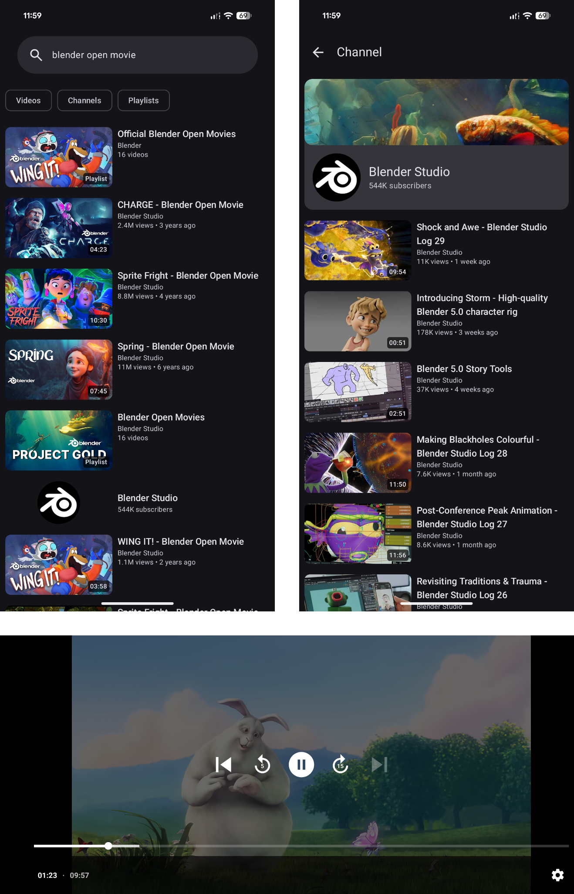

 

# WayTube

A distraction-free YouTube client for Android, built with Jetpack Compose.

## Features

- **Ad-free playback:** Watch videos without interruptions.
- **Background audio:** Minimize the app or turn off your screen to keep listening.
- **SponsorBlock integration:** Automatically skips sponsor segments.
- **Deep link support:** Open `youtube.com` and `youtu.be` links directly in WayTube.

## Installation

To download the APK file directly, visit [Releases](https://github.com/sinatoe/waytube/releases). For automatic updates, you can use [Obtainium](https://github.com/ImranR98/Obtainium) and add this repository as a source.

## Showcase

## Acknowledgements

- [NewPipe Extractor](https://github.com/TeamNewPipe/NewPipeExtractor)
- [SponsorBlock](https://sponsor.ajay.app)

## License

This project is distributed under the GPL-3.0 license.

See the [LICENSE](./LICENSE) for more details.
